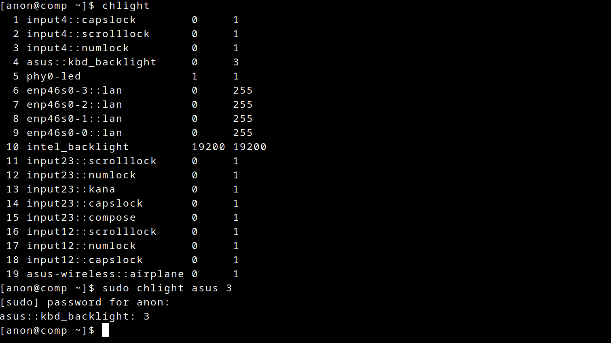

# chlight
'Change Light' Linux utility to modify brightness of ALL devices.


```
Usage: chlight [option] [index|name] [brightness]
Options:
        -h --help      | Displays this information
        -v --verbose   | Verbose
Examples:
        chlight        | List devices | index device brightness max_brightness
        chlight 1 1000 | Index 1 device changed to brightness 1000
        chlight kbd 3  | Device with 'kbd' in its name changed to 3
```
## Installation
```
git clone https://github.com/koivuniemi/chlight.git
cd chlight
make
sudo cp chlight /usr/local/bin/
```
